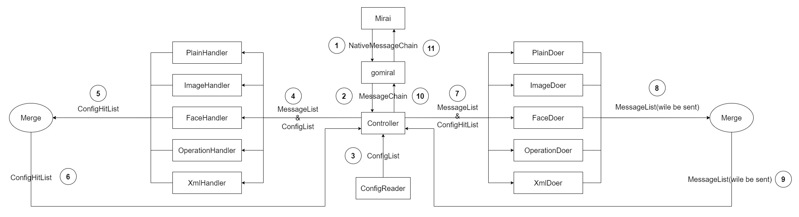

# el-bot-go 文档

本页面主要起目录功能，如果想要快速运行起来本项目，可以按照 [README.md](../README.md) 中的指导进行操作。

# 使用文档

## 目录

+ [配置语法说明](config-syntax.md)
+ [预定义变量说明](pre-def-var.md)

# 开发文档

本项目以 `Controller` 为中心模块，调度各个模块完成工作。

in progress......

## 数据流图

